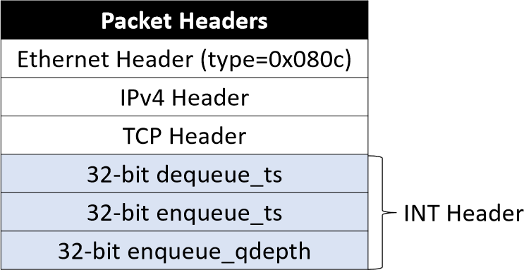
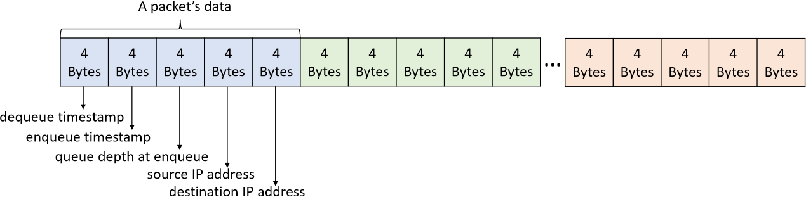

# PrintQueue's End Host Program

The section introduces how PrintQueue generate synthetic traffic, sends, and receives packets at end hosts.

## Receive Packets
The program `DPDK_receive_pkt` runs at end hosts. 
It receives packets from a bound NIC. 
After extracting and storing INT headers from packets, the program drops all packets.
It is able to process packets at high throughput (~10Gbps).

### Compile and Run
PrintQueue leverages [DPDK](https://www.dpdk.org/) to receive packets and process INT headers.
[Here](https://www.yiranlei.com/DPDK_Installation_Tutorial) is a tutorial to install DPDK and bind NIC to DPDK-drivers.
Make sure your NIC is compatible with DPDK. 

After successful installation of DPDK, compile `DPDK_receive_pkt` with:
```shell script
cd DPDK_receive_pkt
make clean
make
```
The compiled program is located in the `build` folder.

After binding the NIC to DPDK-driver, run the program with:
```shell script
make run
```
The program now listens to the NIC, receive packets, extract the PrintQueue INT headers, and store the data in the folder `gt_data`.
The `.bin` data in folder `gt_data` is the ground truth of the experiment.

### PrintQueue INT headers
When a packet runs through the time windows on the switch, it is inserted a header carrying the queuing information.
The information is later served to get the ground truth of diagnosis.
The header is identified by the `type = 0x080c` field of Ethernet header.
It is inserted after the Ethernet, IPv4, TCP header shown as below:



The program stores the dequeue timestamp, enqueue timestamp, queue depth at enqueue time, and packet's flow ID in the `gt_data`.
The layout of binary files is:



## Send Packets
PrintQueue utilizes the [University of Wisconsin Data Center Trace](https://www.microsoft.com/en-us/research/publication/network-traffic-characteristics-of-data-centers-in-the-wild/) and synthetic traces.
For UW trace, we filter out TCP traffic. 

All the pre-processed traces can be download [here](https://cloud.tsinghua.edu.cn/f/c0c8ffa93d704730b826/?dl=1). Unzip it to get `traces` folder:
* Files in the `uw` folder are filtered UW traces.
* Files in the `syn` folder are synthetic traces. Traces with `_ws_` and `_dm_` are in accord with DCTCP and VL2 flow distribution respectively.

PrintQueue leverages [tcpreplay](https://tcpreplay.appneta.com/) and [Pktgen-DPDK](https://pktgen-dpdk.readthedocs.io/en/latest/) to send packets.
In order to achieve high throughput using tcpreplay, PrintQueue uses [Netmap](http://info.iet.unipi.it/~luigi/netmap/) driver.
The [page](https://github.com/luigirizzo/netmap) introduces the installation of Netmap.

Examples to send packets:
* `tcpreplay`
  ```shell script
  sudo tcpreplay -i p2p1 -K -x 1000000000000 --netmap -l 1000 --duration=1 univ1_pt1_tcp_666135.pcap
  sudo tcpreplay -i p2p2 -K -x 1000000000000 --netmap -l 1000 --duration=2 univ1_pt11_tcp_640519.pcap
  ```
* `Pktgen-DPDK`
  ```shell script
  sudo pktgen -l 0-4 -n 4 -- -P -m [1:2].0,[3:4].1 -s 1:traces/d3/test.pcap
  # enter Pktgen shell
  set 0 rate 90
  start
  stop
  ```

## Synthetic Traffic
PrintQueue generates synthetic traffic according to [DCTCP](https://dl.acm.org/doi/10.1145/1851275.1851192) and [VL2](https://dl.acm.org/doi/10.1145/1594977.1592576) flow distribution.
The flow and packet arrivals are Poisson processes. 
Run `pip3 -m install -r requirements.txt` to install dependencies.
Generate traces with the command:
```
rm -rf workloads
mkdir workloads
python3 ./SyntheticTraffic.py
```
The `.pcap` traces will be created under the folder `workloads`.