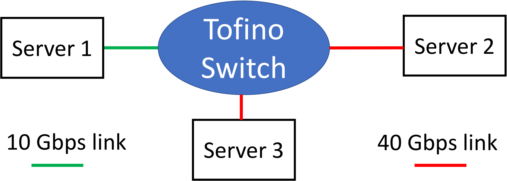
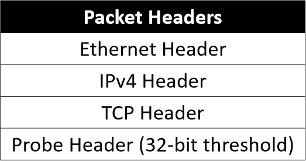
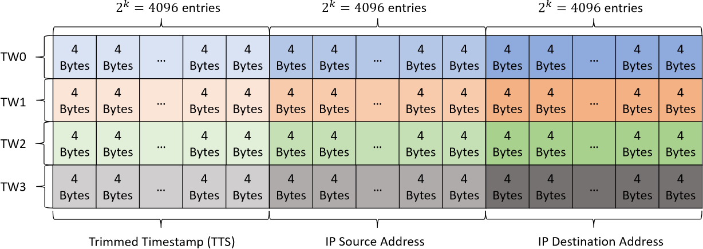
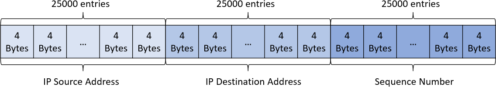

# PrintQueue's P4 code for Tofino

The folder contains PrintQueue's data plane and control plane code. 
The passage explains to compile, run, and manipulate the code. 
The code is tested under `SDE-8.4.0`. The concepts and terms are better explained in the [paper]().

## Compile and Run
The control plane is written in C language located in `./src/ctrl/` folder.
The data plane code is written in [P4<sub>14</sub>](https://p4.org/p4-spec/p4-14/v1.1.0/tex/p4.pdf) language located in `./src/data/` folder.
The configuration file is `./config/printqueue.config`, which is specific to the device. You can get an example configuration file from `$SDE/pkgsrc/p4-examples/tofino`.

Set up folders:
```shell script
make clean_tw
make clean_qm
```

Execute:
```shell script
make configure
make compile
```
to compile the data plane program.

After the successful compilation, execute:
```shell script
make printqueue
```
to compile the control plane program.

Finally, launch the control and data plane program together with:
```shell script
make runPQ
```
Control plane starts to periodically read switch registers by running:
```shell script
kill -s USR1 [PID]
# [PID] is the program ID.
# [PID] is printed when the control plane program is launched.
```

## Testbed Topology
The experiments in the paper are carried on in the following testbed.





When you launch PrintQueue control plane program, first activate corresponding ports in the `port manager`, so that the device can switching packets.
For example, for the testbed:
```shell script
ucli
pm
# enable server1 - switch link
port-add 1/0 10G NONE
an-set 1/0 2
port-enb 1/0
# enable server2 - switch link
port-add 3/0 40G NONE
port-enb 3/0
# enable server3 - switch link
port-add 5/0 40G NONE
port-enb 5/0
```
So far, the data plane and control plane program is running with all links correctly set.
While forwarding packets, the switch keeps measuring queue content and stores relevant data in the registers.
The switch local CPU periodically polls and stores the register values.

Use the code in `../EndHosts` to send and receive packets. 

## Code Manipulation
This section introduces how to manipulate different parts of the code.

### Modify Data Plane
PrintQueue consists of two data structure, i.e., time windows and queue monitor.
Only one structure can run in the data plane at a time.
Decide which data structure is activated in the `main.p4`.
Three options are available:
* `time_windows.p4`: time windows without *data plane query*.
* `time_windows_data_query.p4`: time windows with *data plane query*.
* `queue_monitor.p4`: queue monitor with *data plane query*

Comment the unused parts and compile the program.

To modify the parameters of time windows and queue monitor, modify the constants and parameter values in `includes.p4`.
To change the number of time windows, add or delete windows in the control flow parts of `time_windows.p4` and `time_windows_data_query.p4`.

### Modify Control Plane
Control plane program must be in accord with the data plane program if the activated data structure or parameter values changes.
Modify the parameter values in `PrintQueue.c`. Comment or uncomment the time windows or queue monitor code to keep pace with the data plane.

For higher reading throughput, the control plane program uses *C*, instead of *Python*, API to poll and reset register values.
Beyond that, the program get rids of some unnecessary code to further accelerate reading and save memories.
However, the acceleration makes handle IDs of registers hard-coded in the program. The handle IDs may change under different environments.
Users must check their own IDs and update the `line 310` and `line 413` after successful compilation.
The handler IDs can be found in `$SDE/pkgsrc/p4-build/tofino/printqueue/src/pd.c`.

In the testbed, all the links go through `pipeline 1` of the switch.
Thus the control plane program only stores register values of `pipeline 1`.
However, you may use other pipelines in your setting, as Tofino has 4 pipelines.
In this case, please modify the code in `line 340` and `line 433`.

More detail can be found in the code comments.

### Data Plane Query
*data plane query* is process that data plane program triggers control plane program to read and store register values.
The trigger signal is that the queue depth as a packet enqueues is larger than the packet's preset threshold.
There are two ways to set thresholds.

* Populate flows' thresholds via a flow table `qdepth_alerting_threshold_` in the `ingress.p4`.
The control plane program reads the content of `qdepth_threshold.csv` and populates entries.
The data plane program matches every packet's flow ID in the table to get thresholds.

* End hosts can send packets, with `type` fields of Ethernet headers equal `0x080d`, to set thresholds for the packets.
The packets contain a 32-bit header, standing for the threshold, after Ethernet, IPv4, and TCP header as shown below:





Probe packets have higher priority than flow table when setting thresholds.

## Binary Data
The register values of time windows and queue monitor are stored in folder `./tw_data` and `./qm_data`.
The values are stored in binary format `.bin`.
The layout of binary files is, for example:
* a set of time windows with `k = 12`, `T = 4`:



* queue monitor with a stack depth of 25000:



Use the code in `../AnalysisProgram` to process the register values and diagnose how a certain packet is delayed by others.

## Other commands
Clean time windows' and queue monitor's binary data:
```shell script
make clean_qm
make clean_tw
```
Clean the compiled data plane program.
```shell script
make clean
make distclean
```
Run PrintQueue's data plane program with default control plane program:
```shell script
make configure
make compile
make run
```
