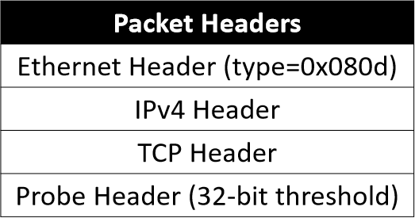
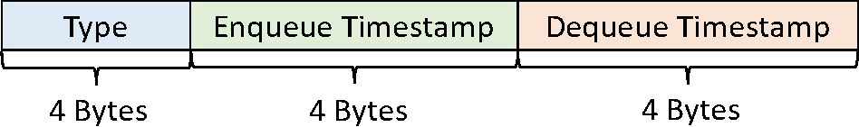

# PrintQueue's Tofino Code

The section contains PrintQueue's data plane and control plane code. 
The section explains how to compile, run, and manipulate the code. 
The code is tested under `SDE-8.4.0`.

## Insert Kernel Module
Load kernel module before launching control plane program:

* PrintQueue - `make kpkt`: load `bf_kpkt`.
* Other programs - `make kdrv`: load `bf_kdrv`.

Unload the current module and turn off control plane program before switching to the other module. 
Check modules with `lsmod` and unload with `rmmod [MOD NAME]`.

When `bf_kpkt` module is successfully loaded, turn on the local interface between the data plane and the control plane with:

```shell script
ifconfig bf_pci0 up
```

## Compile and Run
The control plane is written in C language located in `./src/ctrl/` folder.
The data plane code is written in [P4<sub>14</sub>](https://p4.org/p4-spec/p4-14/v1.1.0/tex/p4.pdf) language located in `./src/data/` folder.
The configuration file is `./config/printqueue.config`, which is specific to the device. You can get an example configuration file from `$SDE/pkgsrc/p4-examples/tofino`.

Set up folders:
```shell script
make clean_tw
make clean_qm
```

Compile the data plane program:
```shell script
make configure
make compile
```

After the data plane compilation, compile the control plane program:
```shell script
make printqueue
```

Launch the control and data plane program together with:
```shell script
make runPQ
```
Control plane starts to read data plane registers by running the commands in **another** terminal:
```shell script
kill -s USR1 [PID]
# [PID] is the program ID.
# [PID] is printed when the control plane program is launched.
```

The register values of time windows and queue monitors will be stored in the `../tw_data/[Port ID]/tw_data` and `../qm_data/[Port ID]/qm_data` folder.
The data plane query signals will be stored in the `../tw_data/[Port ID]/signal_data/` and `../qm_data/[Port ID]/signal_data/`.

## Testbed Topology
The experiments in the paper are carried on in the following testbed.


Enable ports according to your topology (see `Port Setting` part in `PrintQueue.c`).
Or you can use Tofino command-line tools to set up, for example: 

```shell script
ucli
pm
# enable server1 - switch link
port-add 1/0 10G NONE
an-set 1/0 2
port-enb 1/0
# enable server2 - switch link
port-add 3/0 40G NONE
port-enb 3/0
# enable server3 - switch link
port-add 5/0 40G NONE
port-enb 5/0
```
So far, the data plane and control plane program is running with all links correctly set.
While forwarding packets, the switch keeps measuring queue content and stores relevant data in the registers.
The switch local CPU polls and stores the register values.

Use the code in `../EndHosts` to send and receive packets. 

## Code Manipulation
This section introduces how to manipulate different parts of the code.

### Modify Data Plane
PrintQueue consists of two data structure, i.e., time windows and queue monitor.
Only one structure can run in the data plane at a time.
Decide which data structure is activated in the `main.p4`.
Two options:
* `time_windows_data_query.p4`: time windows with data plane query.
* `queue_monitor.p4`: queue monitor with data plane query.

Comment the unused parts and compile the program.

To modify the parameters of time windows and queue monitor, modify the constants and parameter values in `includes.p4`.
To change the number of time windows, add or delete windows in the control flow parts of `time_windows_data_query.p4`.

### Modify Control Plane
Control plane program must be in accord with the data plane program if the activated data structure or parameter values changes.
Modify the parameter values in `PrintQueue.c` (`line 481 - 494`). Comment or uncomment the time windows or queue monitor code to keep pace with the data plane.

For higher reading throughput, the control plane program uses *C*, instead of *Python*, API to poll and reset register values.
Beyond that, the program get rids of some unnecessary code to further accelerate reading and save memories.
However, the acceleration makes handle IDs of registers **hard-coded** in the program. The handle IDs may change under different environments.
Users must check their own IDs and update the `line 300, 328, 399, 425` after successful compilation.
The handler IDs can be found in `$SDE/pkgsrc/p4-build/tofino/printqueue/src/pd.c`.

In the testbed, all the links go through `pipeline 1` of the switch.
Thus the control plane program only stores register values of `pipeline 1`.
However, you may use other pipelines in your setting, as Tofino has 4 pipelines.
In this case, please modify the code in `line 352` and `line 445`.

### Data Plane Query
*data plane query* is process that data plane program triggers control plane program to read and store register values.
The trigger signal is that the queue depth, as a packet enqueues, is larger than the packet's preset threshold.
There are two ways to set thresholds.

* Modify the content of `qdepth_threshold.csv`. The control plane program populates the file entries to a flow table `qdepth_alerting_threshold_` in the `ingress.p4`.
The data plane program matches every packet's flow ID in the table to get thresholds. If no match is found, set the threshold to the default value (defined as `DEFAULT_QDEPTH_THRESHOLD` in `includes.p4`).

* End hosts can send packets, with `type` fields of Ethernet headers equal `0x080d`, to set thresholds for the packets.
The packets contain a 32-bit header, standing for the threshold, after Ethernet, IPv4, and TCP header as shown below:


Probe packets have higher priority than flow table when setting thresholds. 

The signals are stored in `.bin` files in the `../tw_data/[Port ID]/signal_data` and `../qm_data/[Port ID]/signal_data`.
The layout of binary files is:



`Type` can have the following values:
* 1: sequence number overflows of queue monitor.
* 2: data plane query of queue monitor.
* 4: data plane query of time windows.

Control plane program leverages a tunnel between CPU and data plane to receive trigger signals.
`bf_kpkt` kernel module needs to be loaded to create the tunnel.
The default CPU port of pipeline 1 is `192`.
Modify the code in `line 846` if using other pipelines or different devices.
When program is successfully launched, a new network interface will be created, on which CPU listens to get data plane signals.
Turn on the interface:
```shell script
ifconfig [INTERFACE NAME] up
# example: ifconfig bf_pci0 up
```

## Binary Data
The register values of time windows and queue monitor are stored in folder `../tw_data/[Port ID]/tw_data` and `../qm_data/[Port ID]/qm_data`.
The values are stored in binary format `.bin`.
The layout of binary files is, for example:
* a set of time windows with `k = 12`, `T = 4`:


* queue monitor with a stack depth of 25000:


When evaluating time windows, put the folder `gt_data` collected from receiver servers in the `../tw_data/[Port ID]/`.
`gt_data` serves as the ground truth data. 
Use the code in `../AnalysisProgram` to get P&R accuracy of time windows.

## Port Isolation
Time windows and queue monitor are implemented on certain ports.
Each port has it individual set of registers without interfering each other.
To enable PrintQueue on certain port, modify `./src/ctrl/port_isolation.csv`.
Add the port's data plane ID with a Port ID starting from 0.
The register values of the port are stored in `../tw_data/[Port ID]` and `../qm_data/[Port ID]`.

To modify the number of registers for a single port, modify the `SINGLE_PORT_` in the `includes.py` and `k, kq` in the `PrintQueue.c`.
To modify the total number of all registers, modify `INDEX_NUM`,`HALF_INDEX_NUM`, `TOTAL_QDEPTH`,`HALF_QDEPTH` in the `includes.py` and `highest_shift_bit`, `second_highest_shift_bit` in the `PrintQueue.c`.


## Other commands
Clean time windows' and queue monitor's binary data:
```shell script
make clean_qm
make clean_tw
```
Clean the compiled data plane program.
```shell script
make clean
make distclean
```
Run PrintQueue's data plane program with default control plane program:
```shell script
make configure
make compile
make run
```
