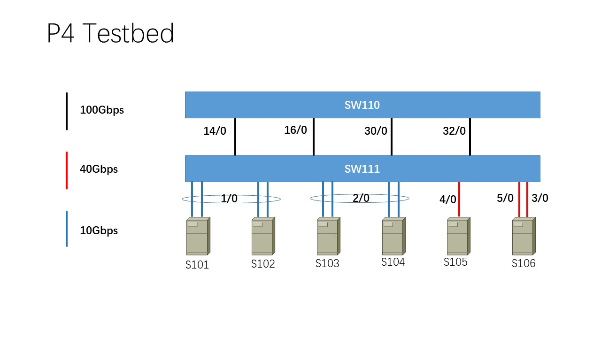

## Topology
>Author: Yiran Lei, Tsinghua University, leiyr20@mails.tsinghua.edu.cn
>This file descripts the structure, port configuration of the testbed



Server: `S106`


| Host | Ipv4 Address | SW Mac Address    | SW Port | NIC        | Speed |
| ---- | ------------ | ----------------- | ------- | ---------- | ----- |
| S101 | 202.112.237.101   | 3c:2c:99:d5:76:d1 | 1/0,128 | enp130s0f1 | 10G   |
| S102 | 202.112.237.102   | 3c:2c:99:d5:76:d3 | 1/2,130 | enp131s0f1 | 10G   |
| S103 | 202.112.237.103   | 3c:2c:99:d5:76:d5 | 2/0,136 | enp131s0f1 | 10G   |
| S104 | 202.112.237.104   | 3c:2c:99:d5:76:d7 | 2/2,138 | enp4s0f0   | 10G   |
| S105 | 202.112.237.105   | 3c:2c:99:d5:76:dd | 4/0,152 | enp5s0f0   | 40G   |
| S106 | 202.112.237.106   | 3c:2c:99:d5:76:d9 | 3/0,144 | enp5s0f1   | 40G   |


pkggen ports:

There are 2 pipelines in total.

| Pipe ID | Port    | Mac Address       |
| ------- | ------- | ----------------- |
| 1/32    | 5/0,160 | 3c:2c:99:d5:76:e1 |
| 0/32    | 21/0,32 |                   |

`SW111` Routing Table:

| Ipv4 Address | port |
| ------------ | ---- |
| 202.112.237.101   | 128  |
| 202.112.237.102   | 130  |
| 202.112.237.103   | 136  |
| 202.112.237.104   | 138  |
| 202.112.237.105   | 152  |
| 202.112.237.106   | 106  |


Scripts:

Add & Enable ports:

(for 10G ports, `an-set` needs to be set to 2 before being enabled; for 40G ports, no `an-set` is needed)

```bash
port-add 1/0 10G NONE
an-set 1/0 2
port-enb 1/0

port-add 1/2 10G NONE
an-set 1/2 2
port-enb 1/2

port-add 2/0 10G NONE
an-set 2/0 2
port-enb 2/0

port-add 2/2 10G NONE
an-set 2/2 2
port-enb 2/2

port-add 3/0 40G NONE
port-enb 3/0

port-add 4/0 40G NONE
port-enb 4/0

```

Disable & Delete ports:

```bash
port-dis 1/0
port-del 1/0
```

Check all network interfaces and turn on/off interfaces:
```bash
ifconfig -a
ifconfig [INTERFACE_NAME] up
ifconfig [INTERFACE_NAME] down
```