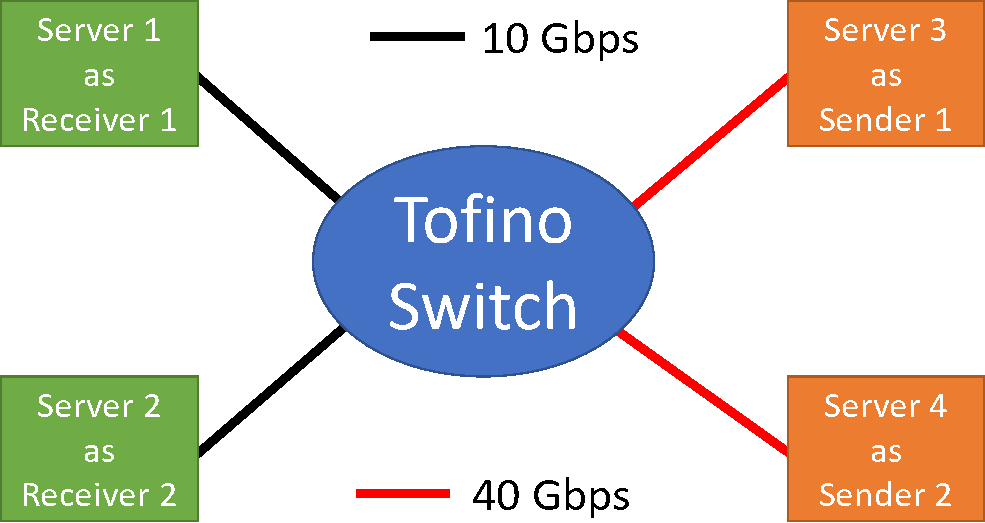

# PrintQueue: Performance Diagnosis via Queue Measurement in the Data Plane

The repository implements queue measurement techniques proposed in the paper entitled:

> [PrintQueue: Performance Diagnosis via Queue Measurement in the Data Plane](https://dl.acm.org/doi/pdf/10.1145/3544216.3544257).
> **Yiran Lei, Liangcheng Yu, Vincent Liu, Mingwei Xu**. SIGCOMM'22.

Please find more information about the paper [here](https://dl.acm.org/doi/10.1145/3544216.3544257).

## Architecture of the repository
The repository consists of three parts:
*  `AnalysisProgram`: process the register values polled from switches and execute queries.
*  `PrintQueue_Tofino`: PrintQueue's *P4<sub>14</sub>* data plane code and *C* control plane code running at [Intel Tofino](https://www.intel.com/content/www/us/en/products/network-io/programmable-ethernet-switch/tofino-series.html) switch.
*  `EndHosts`: receive packets and generate synthetic traffic on the ends.

## Testbed Requirement
### Hardware
* 1x Barefoot Tofino switch.
* 4x Servers with a DPDK-compatible NIC and multi-core CPU. We use `Intel XL710 for 40GbE QSFP+` and `Intel 82599ES 10-Gigabit SFI/SFP+`.

The machines are connected as follows:



### Software
The current version of PrintQueue is tested on:
* Tofino switch SDE == 8.4
* DPDK == 21.11, a [guide](https://www.yiranlei.com/DPDK_Installation_Tutorial) to install DPDK.
* Python3 >= 3.6.9, dependencies are listed in the `requirements.txt` in each folder.
 
## Run Project
### Step 1: compile PrintQueue in switch
In switch, run:
```
cd PrintQueue_Tofino
make kpkt             # load bf_kpkt module
ifconfig bf_pci0 up   # turn on the local interface
make clean_tw         # clean previous register values
make clean_qm
make configure        # compile data-plane program
make compile
make printqueue       # compile control-plane program
make runPQ            # run the system
```
The data plane and control plane programs should be successfully compiled. 
See the data plane program compilation [log](./doc/PrintQueue_data_plane_program_compilation.log) and control plane program compilation [log](./doc/PrintQueue_control_plane_program_compilation.log) in our testbed.

### Step 2: Receive traffic in receivers
In receiver servers, run:
```
cd EndHosts/DPDK_receive_pkt
make clean
make
make run
```
The program starts to listen to the NIC and receive packets.
PrintQueue INT headers are extracted and stored in the `gt_data` folder. 
Then data later serves as the ground truth when calculate accuracy.

See the receiver program [log](./doc/Receiver_listen.log) in our testbed.

### Step 3: send traffic at senders and activate PrintQueue
Download and unzip the pre-processed [traces](https://drive.google.com/file/d/1VWhmNH-q17jxobIvcAnXY4lNevCtRv97/view?usp=sharing).

At two senders, run simultaneously:
* sender 1
    ```
    cd traces/uw
    sudo tcpreplay -i p2p1 -K -x 1000000000000 --netmap -l 1000 --duration=1 univ1_pt1_tcp_666135.pcap
    ```
* sender 2
    ```
    cd traces/uw
    sudo tcpreplay -i p2p2 -K -x 1000000000000 --netmap -l 1000 --duration=2 univ1_pt12_tcp_597678.pcap
    ```
See the tcpreplay [log](./doc/Sender.log) in our testbed.

When servers send traffic, activate PrintQueue in switch. In another switch terminal, run:
```
kill -s USR1 [PID]
# [PID] is the control plane program ID.
# [PID] is printed when the control plane program is launched.
```
The control plane program starts to poll and store register values from data planes.
The register values are stored in `qm_data` and `tw_data`, which are later used to track culprit packets.

See the PrintQueue control plane program [log](./doc/PrintQueue_control_plane_program_runtime.log) in our testbed.

### Step 4: collect PrintQueue result and ground truth

Data is distributed across machines:
* receiver servers: the PrintQueue INT headers containing the every packet's queuing information. 
It is served as the ground truth, stored in `gt_data`.
* switch: the register values of time windows (stored in `tw_data`) and queue monitor (stored in `qm_data`).
These values are used to track culprit packets. The signals of data plane query are stored in `signal_data`.

To evaluate the accuracy of PrintQueue, collect the `gt_data`, `tw_data`, `signal_data`, and `qm_data` from multiple machines.

Run the script (remember to tune parameters first) to calculate the precision and recall accuracy:
```
cd AnalysisProgram
python3 ./GroundTruth.py
```

See the evaluation script [log](./doc/script.log) in our testbed.

PrintQueue is evaluated under different queue depths and compared with related works.
Suppose we need to run tests under queue depth 1k - 2k, 2k - 5k, 5k - 10k, 10k - 15k, 15k - 20k, and above 20k.

**Asynchronous Query**:

Input `[1000, 2000, 5000, 10000, 15000, 20000]` as a parameter to the script, the script will output 6 csv files. 
Each file stores results within the corresponding queue range.
Each line represents the result of a sampled packet. We use PrintQueue (PQ), FlowRadar (FR), Count-Min Sketch(CMS), and HashPipe (HP) to track culprit packets for that sampled packet.
The results are stored in the following format:

| Packet ID | Enqueue Timestamp | Dequeue Timestamp | Queue Depth | PQ P| PQ R| CMS1 P | CMS2 R| HP1 P | HP1 R| HP2 P | HP2 R| FR1 P | FR1 R | FR2 P | FR2 R| 
|---|---|---|---|---|---|---|---|---|---|---|---|---|---|---|---|

`P` stands for precision accuracy and `R` represents recall accuracy. Because Count-Min Sketch can only provide frequency not flow ID, we do not include it in our paper.
For HashPipe and FlowRadar, we use different number of registers to have two tracking results.

**Data Plane Query**:
Every time we run the system, the queue depth threshold to trigger data plane query is fixed.
So we can only get the data plane query accuracy under **one** queue depth.
To get accuracy of data plane query under different queue depths, modify the parameters in the `includes.p4` and re-run the system.

The result of the current queue is stored in `data_plane_query_accuracy.csv` in the format:

|PQ Precision| PQ Recall|
|---|---|

Each line is the accuracy for one signal.

## Reproduce Results
Every time when changing parameters, traces, and port settings, you need to go through the above process, collect data from different parts, and run the scripts.
We know the difficulty of building such a complex system.
Therefore, we store all the intermediate register values and INT headers collected from our testbed, **unmodified**.
All the data is stored in `.bin` files. The way of interpretation is introduced in `EndHosts` and `PrintQueue_Tofino`.
You can directly calculate the accuracy with the intermediate data.

Download the [intermediate data](https://drive.google.com/file/d/1HPsf9jikIqGdfLZguUjfNj6T-7ojkAVH/view?usp=sharing). Run the following scripts. Check P&R accuracy in csv files in the subfolder of `intermediate_data` folder. 
Note that we randomly choose some intermediate data to save space.  The results in the paper actually come from multiple sets of data.

* Figure 9: Accuracy vs Queue Depth
    * Under DCTCP traces:
        * asynchronous query + data plane query under queue = 1000
          ```
          python3 ./reproduce.py --a 1 --k 12 --T 4 --TB 10 --z 0.8192 --path ./intermediate_data/DifferentQueueDepth/ws/1000
          ```
        * asynchronous query + data plane query under queue = 2000
          ```
          python3 ./reproduce.py --a 1 --k 12 --T 4 --TB 10 --z 0.8192 --path ./intermediate_data/DifferentQueueDepth/ws/2000
          ```
        * asynchronous query + data plane query under queue = 5000
          ```
          python3 ./reproduce.py --a 1 --k 12 --T 4 --TB 10 --z 0.8192 --path ./intermediate_data/DifferentQueueDepth/ws/5000
          ```
        * asynchronous query + data plane query under queue = 10000
          ```
          python3 ./reproduce.py --a 1 --k 12 --T 4 --TB 10 --z 0.8192 --path ./intermediate_data/DifferentQueueDepth/ws/10000
          ```
        * asynchronous query + data plane query under queue = 15000
          ```
          python3 ./reproduce.py --a 1 --k 12 --T 4 --TB 10 --z 0.8192 --path ./intermediate_data/DifferentQueueDepth/ws/15000
          ```
        * asynchronous query + data plane query under queue = 20000
          ```
          python3 ./reproduce.py --a 1 --k 12 --T 4 --TB 10 --z 0.8192 --path ./intermediate_data/DifferentQueueDepth/ws/20000
          ```
    * Under VL2 traces:
        * asynchronous query + data plane query under queue = 1000
          ```
          python3 ./reproduce.py --a 1 --k 12 --T 4 --TB 10 --z 0.8192 --path ./intermediate_data/DifferentQueueDepth/dm/1000
          ```
        * asynchronous query + data plane query under queue = 2000
          ```
          python3 ./reproduce.py --a 1 --k 12 --T 4 --TB 10 --z 0.8192 --path ./intermediate_data/DifferentQueueDepth/dm/2000
          ```
        * asynchronous query + data plane query under queue = 5000
          ```
          python3 ./reproduce.py --a 1 --k 12 --T 4 --TB 10 --z 0.8192 --path ./intermediate_data/DifferentQueueDepth/dm/5000
          ```
        * asynchronous query + data plane query under queue = 10000
          ```
          python3 ./reproduce.py --a 1 --k 12 --T 4 --TB 10 --z 0.8192 --path ./intermediate_data/DifferentQueueDepth/dm/10000
          ```
        * asynchronous query + data plane query under queue = 15000
          ```
          python3 ./reproduce.py --a 1 --k 12 --T 4 --TB 10 --z 0.8192 --path ./intermediate_data/DifferentQueueDepth/dm/15000
          ```
        * asynchronous query + data plane query under queue = 20000
          ```
          python3 ./reproduce.py --a 1 --k 12 --T 4 --TB 10 --z 0.8192 --path ./intermediate_data/DifferentQueueDepth/dm/20000
          ```
    * Under UW traces:
         * asynchronous query + data plane query under queue = 1000
          ```
          python3 ./reproduce.py --a 2 --k 12 --T 4 --TB 6 --z 0.582 --path ./intermediate_data/DifferentQueueDepth/uw/1000
          ```
        * asynchronous query + data plane query under queue = 2000
          ```
          python3 ./reproduce.py --a 2 --k 12 --T 4 --TB 6 --z 0.582 --path ./intermediate_data/DifferentQueueDepth/uw/2000
          ```
        * asynchronous query + data plane query under queue = 5000
          ```
          python3 ./reproduce.py --a 2 --k 12 --T 4 --TB 6 --z 0.582 --path ./intermediate_data/DifferentQueueDepth/uw/5000
          ```
        * asynchronous query + data plane query under queue = 10000
          ```
          python3 ./reproduce.py --a 2 --k 12 --T 4 --TB 6 --z 0.582 --path ./intermediate_data/DifferentQueueDepth/uw/10000
          ```
        * asynchronous query + data plane query under queue = 15000
          ```
          python3 ./reproduce.py --a 2 --k 12 --T 4 --TB 6 --z 0.582 --path ./intermediate_data/DifferentQueueDepth/uw/15000
          ```
        * asynchronous query + data plane query under queue = 20000
          ```
          python3 ./reproduce.py --a 2 --k 12 --T 4 --TB 6 --z 0.582 --path ./intermediate_data/DifferentQueueDepth/uw/20000
          ```
      
 * Figure 10: PrintQueue vs Related Works under UW traces
   ```
   python3 ./reproduce.py --a 2 --k 12 --T 4 --TB 6 --z 0.582 --path ./intermediate_data/RelatedWorks/ --Q 1000 5000 15000 --N 100
   ```

 * Figure 11: PrintQueue vs Parameters under UW traces
    * a=2, k=11, T=4:
      ```
      python3 ./reproduce.py --a 2 --k 11 --T 4 --TB 6 --z 0.582 --path ./intermediate_data/Parameters/2_11_4
      ```
    * a=2, k=12, T=4:
      ```
      python3 ./reproduce.py --a 2 --k 12 --T 4 --TB 6 --z 0.582 --path ./intermediate_data/Parameters/2_12_4
      ```
    * a=2, k=12, T=5:
      ```
      python3 ./reproduce.py --a 2 --k 12 --T 5 --TB 6 --z 0.582 --path ./intermediate_data/Parameters/2_12_5
      ```
    * a=3, k=12, T=4:
      ```
      python3 ./reproduce.py --a 3 --k 12 --T 4 --TB 6 --z 0.582 --path ./intermediate_data/Parameters/3_12_4
      ```
 
 * Figure 14: SRAM usage - the numbers come from Tofino resource usage [log (a=2,k=12,T=4)](./doc/resources.log).
 (Note: we will modify the number. when submit the first version paper, we do not fully implement PQ. The utilization is under-estimated)
 
 * Figure 13: Transmission overhead can be calculated, as certain number of register values should be transmitted to the control plane periodically.
 The accuracy comes from previous experiments.
 
 * Figure 15: Port Isolation. Implement PrintQueue for each port to isolate ports' mutual impacts. 
 Each port has it own set of registers. The figure shows the relation between the accuracy, SRAM usage and the number of ports.
    * 1 port:
      ```
      python3 ./reproduce.py --a 1 --k 12 --T 4 --TB 10 --z 0.8192 --path ./intermediate_data/PortIsolation/1port/ID_0
      ```
    * 2 ports:
      ```
      python3 ./reproduce.py --a 1 --k 11 --T 4 --TB 10 --z 0.8192 --path ./intermediate_data/PortIsolation/2ports/ID_0
      ```
    * 4 ports:
      ```
      python3 ./reproduce.py --a 2 --k 10 --T 4 --TB 10 --z 0.8192 --path ./intermediate_data/PortIsolation/4ports/ID_0
      ```
    * 8 ports:
      ```
      python3 ./reproduce.py --a 2 --k 10 --T 4 --TB 10 --z 0.8192 --path ./intermediate_data/PortIsolation/8ports/ID_0
      ```
    * 10 ports:
      ```
      python3 ./reproduce.py --a 2 --k 10 --T 4 --TB 10 --z 0.8192 --path ./intermediate_data/PortIsolation/10ports/ID_0
      ```
 * Figure 12: Different time windows vs Top-K flows. We let the whole window track Top-K flow packet counts.
   ```
   python3 ./reproduce.py -TopK --path ./intermediate_data/TopK
   ```
   The results are stored in `TopK.csv` in each subfolder. The file format is as follows:
   
   | Time window index | Top-K | Precision | Recall |
   |---|---|---|---|
 
## Contact
Please raise [issues](https://github.com/A-Dying-Pig/PrintQueue/issues) if you have any questions or doubts about the code.
Feel free to contact via email leiyr20 [at] mails [dot] tsinghua [dot] cn.
